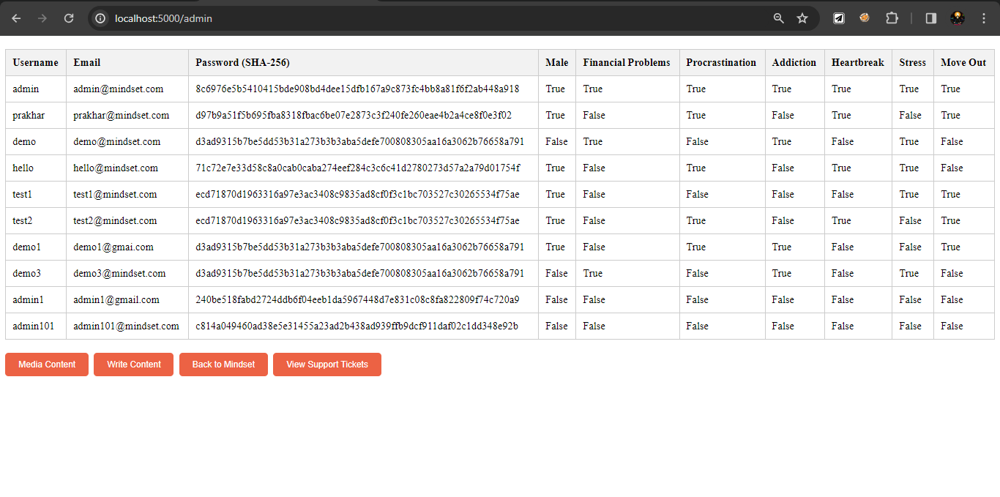

# MindSet 
#### ~ Originally Developed and created by _Prakhar Porwal_ 💀
**Mindset:** A Personalized Support Platform for Mental Well-being where no algorithm spoils your mental well-being.

Mindset is a web application that provides personalized support and resources for individuals navigating mental health challenges. Through user-friendly features and personalized recommendations, Mindset empowers users to take charge of their mental well-being and connect with supportive communities.
<br>
## Key Features:

**Personalized Video Recommendations:** Based on your selected preferences, Mindset curates a collection of relevant reels and long-form videos to address your concerns.

**User-friendly Signup and Login:** Easily create an account or log in to access your personalized support tools.

**Secure and Confidential:** Mindset prioritizes user privacy and data security, ensuring your information remains confidential.

**Admin Portal for Content Management and Support Ticket Management:** Admins can manage content, upload videos, and view user support tickets.
<br>
## Benefits:

**Personalized Support:** Access tailored resources and recommendations that align with your unique needs.

**Empowerment and Self-management:** Take control of your mental well-being with personalized guidance and support.

**Supportive Community:** Connect with others facing similar challenges and foster a sense of belonging.

**Convenient Access:** Access support from anywhere, anytime, using your web browser.
<br>
## Target Audience:

Mindset is designed for individuals seeking personalized support for mental health challenges, including:

- Stress
- Addiction
- Financial Problems
- Procrastination
- Heartbreak
- Move-out

<hr>

# Technical Details 👨🏻‍💻
**Flask Application with User Authentication and Content Management**
- This Flask application demonstrates user authentication, content management, and conditional video recommendations **based on user preferences**.

**User Authentication**
- The application utilizes Flask-Login for user authentication and authorization. Users can sign up, log in, and log out. Admin users have additional privileges to manage content and view support tickets.

### Signup Page


### Login Page


**Content Management**
- Admins can upload reels and long-form videos via the `/admin/content` route. The uploaded content is stored in separate text files based on content type (reel or video).

### Admin Portal


### Publish Writings (Admin)


### Admin Content Management


**Conditional Video Recommendations**
- Users can access personalized video recommendations based on their selected preferences during signup. The application checks the user's preferences against the video content and displays relevant videos on the `/protected/shorts` and `/protected/videos` routes.

**Support Tickets**
- Users can create support tickets by submitting their name and message via the `/support` route. Admins can view all support tickets on the `/admin/tickets` route.

### Support Ticket 


**About Us Page**
- The `/about_us` route displays a simple 'About Us' page.
### About-Us Page


**Application Structure**
- The application is organized into several routes, each handling specific functionalities:

```
/: Default route redirects to login
/signup: User registration route
/success: Success page after registration
/login: User login route
/protected: Home page after login
/admin: Admin portal
/admin/content: Content upload route for admins
/admin/publish: Writing post route for admins
/admin/tickets: View all support tickets route for admins
/protected/shorts: Display reels based on user preferences
/protected/videos: Display long-form videos based on user preferences
/protected/read: Display blog posts
/support: Create a support ticket route
/about_us: About Us page
```
<hr>

# Tech Stack:

**Front-end**: HTML, CSS, (or you can use JS) <br>
**Back-end**: Flask, Flask-SQLAlchemy, Flask-Login <br>
**Database**: SQLite <br>
**Deployment**: Web server (e.g., Gunicorn, uWSGI), Deployment server (e.g., Heroku, AWS, DigitalOcean) <br>

## Requirements:
**User Authentication**: User login, registration, and session management <br>
**Content Management**: Uploading, editing, deleting, and retrieving content (videos, reels, Articles, threads, blogs) <br>
**Recommendation System**: Suggesting content based on user interests <br>
**User Profile Management**: Storing and managing user information (username, password, name, profile photo, interests) <br>
**Content Routing**: Handling user requests for specific content types

## **IMPORTANT NOTE**
Before running the application, make sure to create a test & admin account from the `/signup` endpoint.
- I added a GET request-based authentication condition on every `/admin` route which **is NOT secure enough** because anyone can easily perform the POST request. I made this app in 2-3 days so I didn't implement any strong restrictions but you can ..!! (BTW if you can implement RESTful APIs in this project feel free to create a PR)

### Admin Portal
```
@app.route('/admin', methods=['GET'])
@login_required
def internal():
    if request.method == 'GET': 
        if current_user.username != 'admin':
            return redirect(url_for('login'))

    users = User.query.all()
    return render_template('users.html', users=users)
 
```

- Or you can change the username in the code as per your suitability.

## Please Read This.
- I developed this app myself in a very short time frame(2-3 days). If you're interested in RESTful APIs or just want to develop this project in any manner feel free to collaborate, just create a PR for your idea/implementation, and I would love to add you as a contributor.
